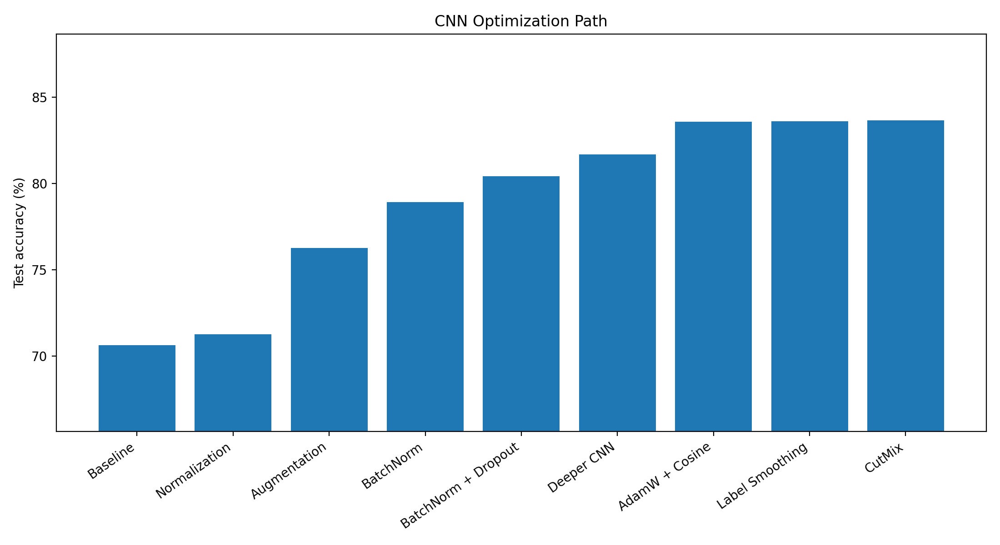
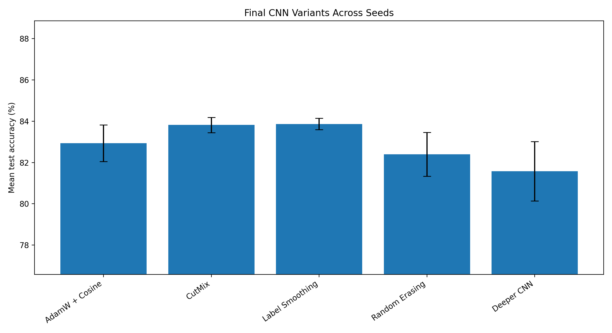
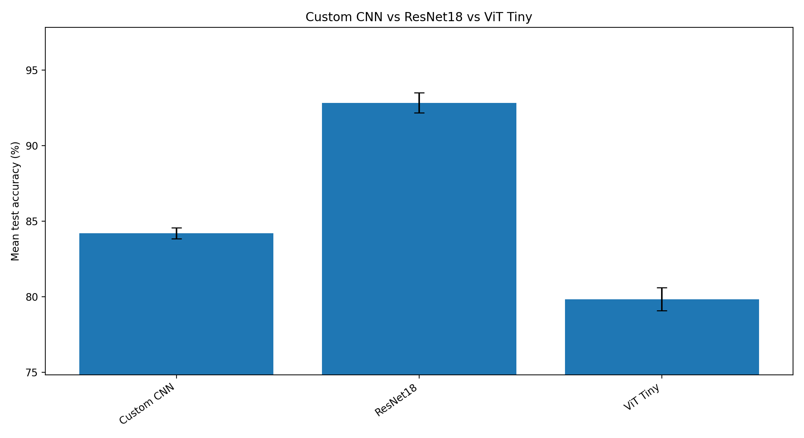
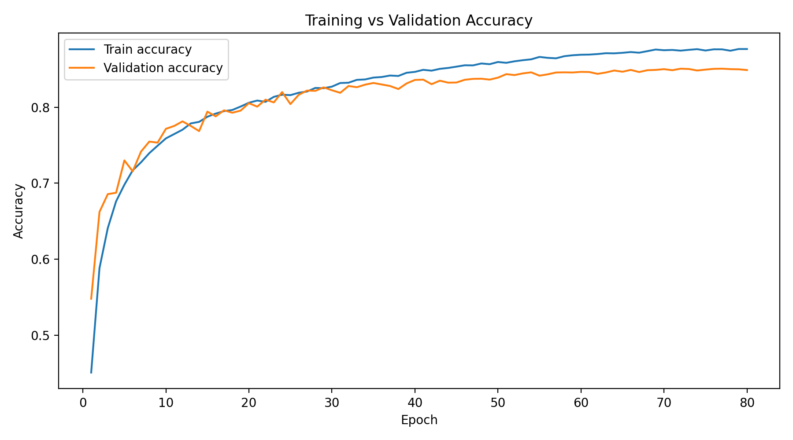
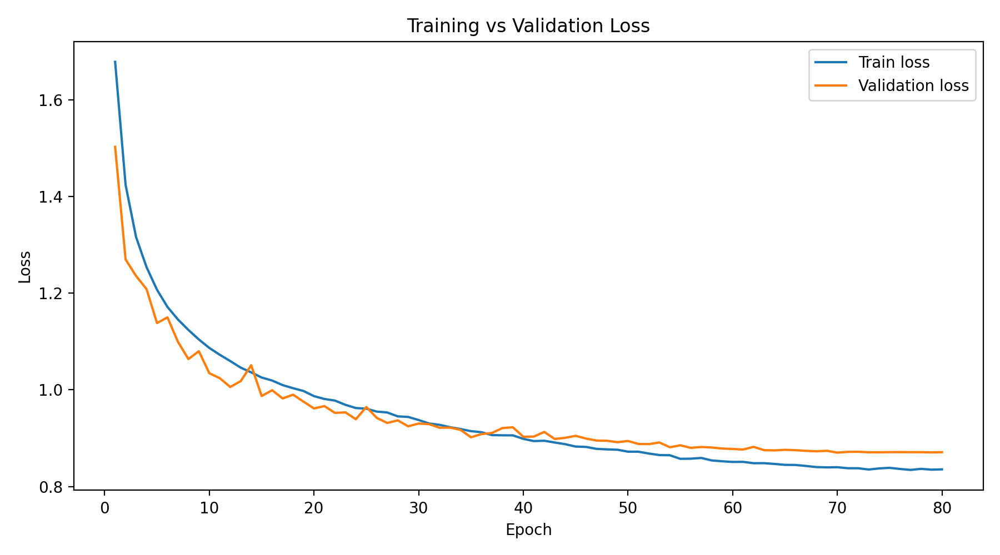
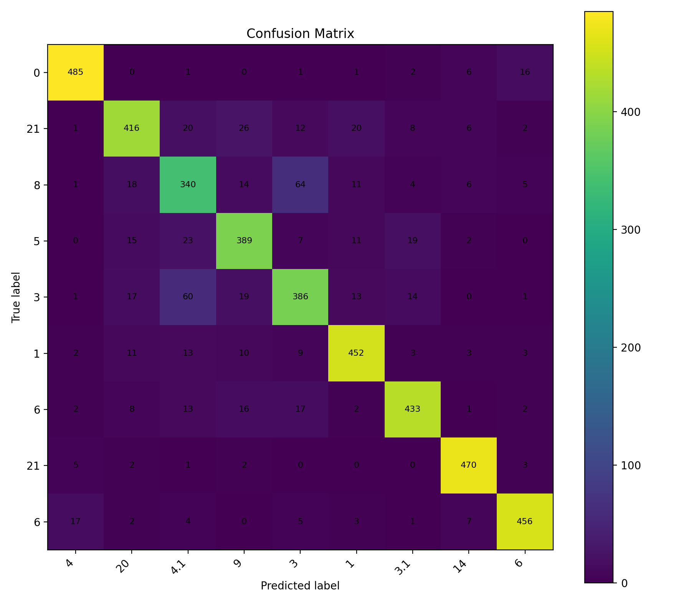

# CIFAR-10 CNN Debugging and Model Comparison

## Project Goal

* Train an image classifier for CIFAR-10.
* Improve a baseline CNN using normalization, augmentation, BatchNorm, dropout, optimizer changes, label smoothing, and CutMix.
* Compare the final custom CNN against ResNet18 and ViT Tiny.
* Use graphs, tables, and confusion matrices to summarize the results.

## Dataset

* Dataset: CIFAR-10
* Task: 10-class image classification
* Image format: RGB images
* Classes:

  * airplane
  * automobile
  * bird
  * cat
  * deer
  * dog
  * frog
  * horse
  * ship
  * truck

## Models Tested

### Custom CNN

The custom CNN was improved across multiple experiment stages:

* Baseline CNN
* Normalized input images
* Data augmentation
* Batch normalization
* Dropout
* Deeper CNN with an extra convolution block
* AdamW optimizer
* Cosine learning rate scheduling
* Label smoothing
* CutMix
* Random erasing

### ResNet18

A ResNet18 model was trained as a stronger CNN-based architecture.

### ViT Tiny

A small Vision Transformer model was also tested for comparison.

## Experiment Setup

* Loss function: CrossEntropyLoss
* Main optimizer: Adam / AdamW
* Learning rate: mostly `0.001`
* Weight decay for AdamW experiments: `0.0005`
* Main training length: up to 80 epochs
* Multiple seeds were used for the final experiments:

  * seed 0
  * seed 1
  * seed 42

## CNN Optimization Path

The baseline CNN improved significantly as more training improvements were added.

Key points:

* The original baseline reached about **70.63%** test accuracy.
* Normalization alone gave only a small improvement.
* Data augmentation gave a much larger improvement.
* Batch normalization improved the CNN further.
* The deeper CNN and optimizer improvements pushed the model above **80%** test accuracy.
* The final custom CNN variants reached around **84%** test accuracy.

## Final Custom CNN Variants

The final CNN variants were compared across multiple seeds.

| CNN Variant     | Mean Test Accuracy | Best Test Accuracy |
| --------------- | -----------------: | -----------------: |
| Deeper CNN      |             81.58% |             82.97% |
| AdamW + Cosine  |             82.94% |             83.58% |
| Label Smoothing |             83.87% |             84.15% |
| Random Erasing  |             82.40% |             83.55% |
| CutMix          |             83.82% |             84.24% |

Key points:

* The best average custom CNN setup was **AdamW + cosine scheduler + label smoothing**.
* The best single custom CNN result came from the **CutMix** run with **84.24%** test accuracy.
* Random erasing did not improve results in this experiment.
* CutMix was competitive, but it did not clearly outperform label smoothing on average.

## Custom CNN vs ResNet18 vs ViT Tiny

The final model comparison tested the best custom CNN against ResNet18 and ViT Tiny.

| Model      | Mean Validation Accuracy | Mean Test Accuracy | Best Test Accuracy |
| ---------- | -----------------------: | -----------------: | -----------------: |
| Custom CNN |                   84.53% |             84.20% |             84.61% |
| ResNet18   |                   93.55% |             92.82% |             93.34% |
| ViT Tiny   |                   79.59% |             79.84% |             80.53% |

Key points:

* **ResNet18 was the best model overall**.
* ResNet18 reached about **92.82% mean test accuracy**.
* The custom CNN reached about **84.20% mean test accuracy**.
* ViT Tiny performed worse than the custom CNN in this setup.
* The ResNet18 result shows the advantage of using a stronger CNN architecture with residual connections.

## Best Custom CNN Training Curves

The following curves show the training behavior of the best custom CNN run.

Key points:

* Training accuracy increased steadily over the epochs.
* Validation accuracy also improved, showing that the model was learning useful features.
* The gap between training and validation accuracy helps show whether the model was overfitting.

Key points:

* Training loss decreased as the model learned.
* Validation loss was used to track generalization performance.
* The best checkpoint was selected based on validation performance.

## Confusion Matrix

The confusion matrix shows which CIFAR-10 classes the best custom CNN classified correctly and which classes it confused.

## Main Takeaways

* Data augmentation was one of the biggest improvements over the baseline.
* Batch normalization helped improve training and final accuracy.
* AdamW with cosine scheduling improved the stronger CNN setup.
* Label smoothing produced the best average custom CNN performance.
* CutMix gave the best single custom CNN run, but not the best average result.
* Random erasing did not help in this experiment.
* ResNet18 clearly outperformed both the custom CNN and ViT Tiny.
* ViT Tiny likely needed more tuning, more data, or a different training setup to perform well on CIFAR-10.

## Final Result

The best overall model was:

**ResNet18 with AdamW, cosine scheduling, label smoothing, normalization, and augmentation**

Final performance:

* Mean validation accuracy: **93.55%**
* Mean test accuracy: **92.82%**
* Best test accuracy: **93.34%**

The best custom CNN result was:

**Custom CNN with AdamW, cosine scheduling, label smoothing, BatchNorm, dropout, and an extra convolution block**

Final performance:

* Mean test accuracy: **83.87%**
* Best test accuracy: **84.15%**

The best single custom CNN run was:

**Custom CNN with CutMix**

Final performance:

* Best test accuracy: **84.24%**

## Future Improvements

Possible next steps:

* Try stronger augmentations such as MixUp or AutoAugment.
* Train for more epochs.
* Try larger CNN architectures.
* Add batch normalization and dropout tuning.
* Compare pretrained models against models trained from scratch.
* Tune ViT Tiny more carefully.
